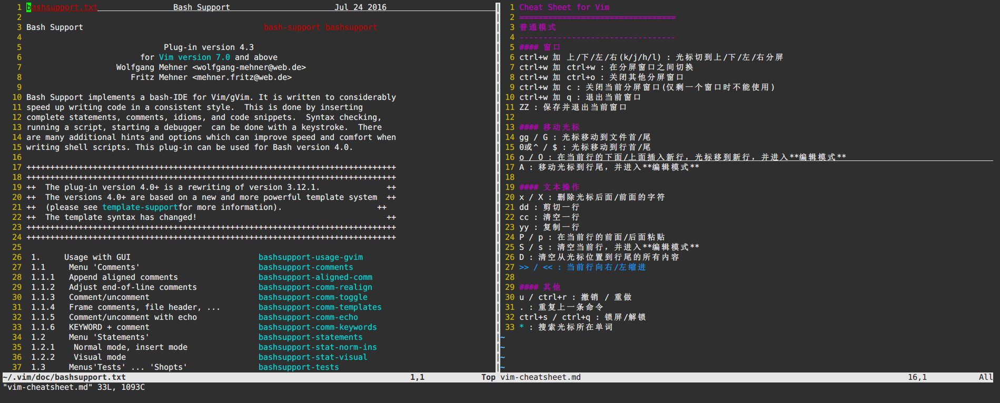

# PlayWithLinux

## vimm
Open `target file` and `vim-cheatsheet.md` together with `vim`.

### usage:
```
vimm [target file] :
  A shortcut for `vim -On [target file] vim-cheatsheet.md`
```
+ Add the directory of `vimm` to `$PATH` so that you can call `vimm` easily.
+ The `vim-cheatsheet.md` file should be in the same path as `vimm` file.

### demo:

