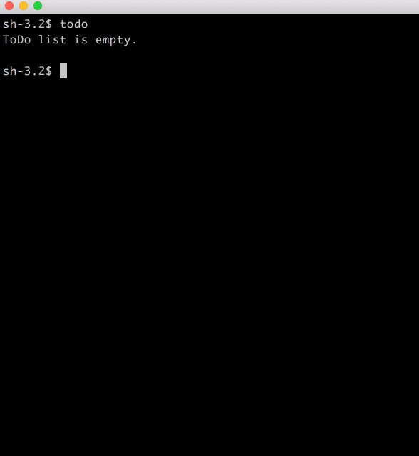

# PlayWithLinux

## 1. vimm
Open `target file` and `vim-cheatsheet.md` together with `vim`.

### usage:
```
vimm [target file] :
  A shortcut for `vim -On [target file] vim-cheatsheet.md`
```
+ Add the directory of `vimm` to `$PATH` so that you can call `vimm` easily.
+ The `vim-cheatsheet.md` file should be in the same path as `vimm` file.

### demo:


## 2. todo

create ToDo list in the command line

### usage

```
todo:
  show all the created todo items
todo add:
  create a new todo item
todo insert [id]:
  insert a new todo item at [id]
todo del [id]:
  delete the item of specified id
todo clear:
  clear all the ToDo items.
todo -h:
  show the usage of todo
```

### demo:



## 3. BibTeX Parser

A (unpolished) Python script for parsing BibTeX

### usage

> Note: `ieee-taslp` is a predefined string in `bibtex.py`. In a .bib file, it is defined as:
> ```
> @string{ieee-taslp = "IEEE Trans. Audio, Speech, Language Process."}
> ```

```python
>>> from bibtex import BibTeXEntry
>>> bibstring = r'''
@article{Performance-Vincent2006,
  title={Performance measurement in blind audio source separation},
  author={Vincent, Emmanuel and Gribonval, R{\'e}mi and F{\'e}votte, C{\'e}dric},
  journal=ieee-taslp,
  volume={14},
  number={4},
  pages={1462--1469},
  year={2006},
}
'''
>>> bib = BibTeXEntry(bibstring)
>>> bib
@article{Performance-Vincent2006,
  title={Performance measurement in blind audio source separation},
  author={Emmanuel, Vincent and R{\'e}mi, Gribonval and C{\'e}dric, F{\'e}votte},
  journal=ieee-taslp,
  volume={14},
  number={4},
  pages={1462--1469},
  year={2006},
}

>>> print(bib.to_plaintext(style='IEEEtran'))
E. Vincent, R. Gribonval, and C. Févotte, “Performance measurement in blind audio source separation,” IEEE Trans. Audio, Speech, Language Process., vol. 14, no. 4, pp. 1462–1469, 2006.

>>> print(bib.to_plaintext(style='IEEEbib'))
Emmanuel Vincent, Rémi Gribonval, and Cédric Févotte, “Performance measurement in blind audio source separation,” IEEE Trans. Audio, Speech, Language Process., vol. 14, no. 4, pp. 1462–1469, 2006.

```
